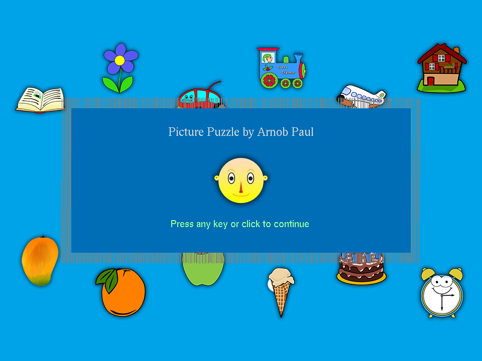
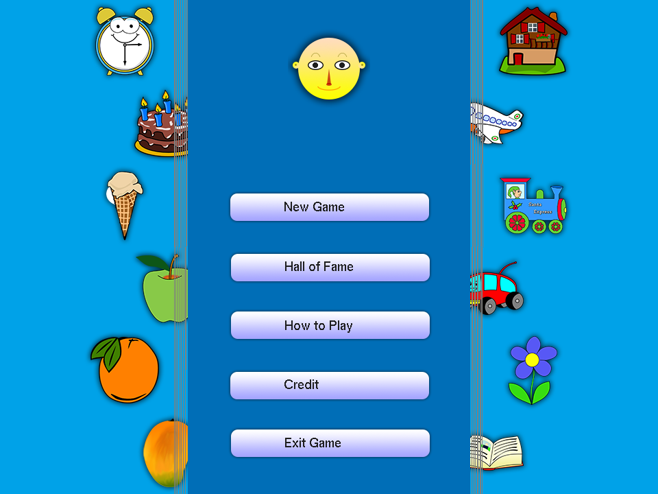
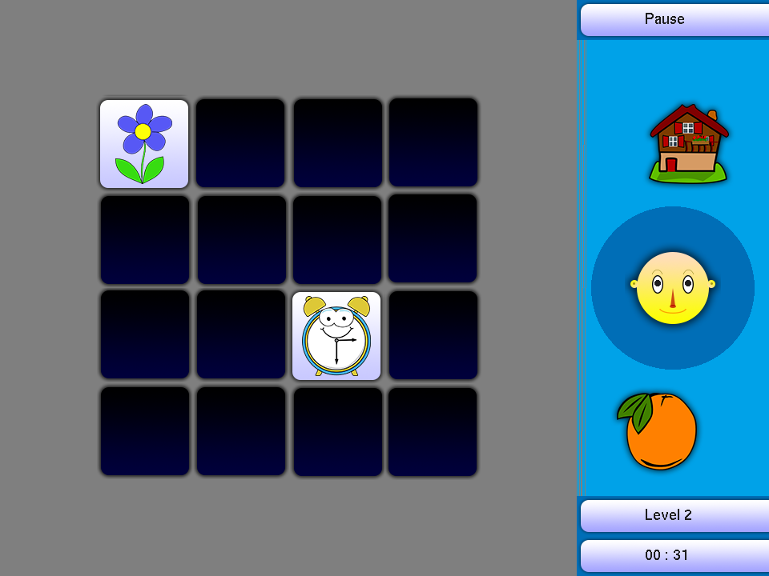

# Picture Puzzle
This is a simple Picture Puzzle game created with C structural programming language (not using OOP). You might notice, the provided source code files contain C++ extension instead of C extension. This is because of taking advantage of some C++ specific features (such as *optional arguments in function*).

## Build and Run
I have used **Visual Studio 2015** to build and run the project. It should work out-of-the-box in Visual Studio 2015. You do not need any other library to be installed beforehand.

## Screenshot
Here are some screenshots of this game:
  - Intro
  
    
  - Main Menu
  
    
  - Gameplay
  
    

## Video
Here is a gameplay video of this game (click to watch):

